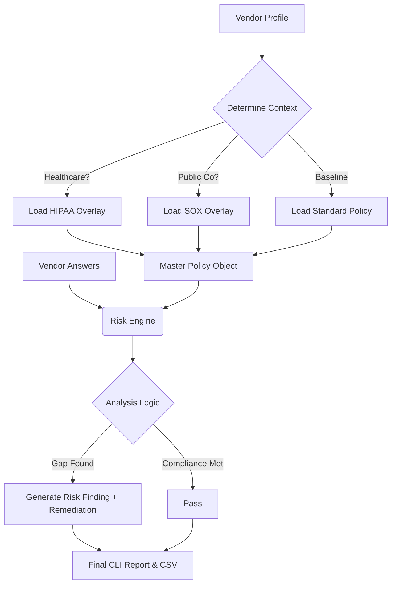

### 📋 Instructions

# ⚖️ AI TPRM Risk Engine (Context-Aware)

### Dynamic Vendor Risk Assessment & Compliance Auditing

[]()
[](https://www.python.org/downloads/)
[]()
[]()

---

### 📖 Overview
Legacy TPRM tools treat every vendor the same. This engine uses **"Context-Aware Logic"** to dynamically generate risk frameworks based on the vendor's profile.

Instead of a static checklist, the system applies **Policy Overlays**:
* **Healthcare Vendor?** → Automatically enforces **HIPAA BAA** & Data Retention checks.
* **Public Company?** → Automatically enforces **SOX ITGC** (Segregation of Duties).
* **Enterprise Scale?** → Automatically enforces stricter **SLA & Insurance** limits.


### ⚡ Feature Highlights
* **Dynamic Policy Overlays:** Merges a "Universal Baseline" with industry-specific rule sets (YAML-based).
* **Weighted Scoring:** Calculates a precise risk score (0-100) based on control criticality.
* **Auto-Remediation:** Automatically maps failures to specific remediation actions (e.g., "Implement SSO").
* **Audit Trail:** Exports a CSV report for compliance evidence.

---

### 🛠️ Quick Start

#### 1. Clone the Repository
```bash
git clone [https://github.com/codyjkeller/ai-tprm-analyzer.git](https://github.com/codyjkeller/ai-tprm-analyzer.git)
cd ai-tprm-analyzer
pip install -r requirements.txt

```

#### 2. Generate Sample Data

Run the included script to create a dummy vendor profile:

```bash
python src/create_dummy_data.py

```

#### 3. Run the Assessment

```bash
python src/analyzer.py

```

---

### 🧠 Architecture Logic



---

### 📂 File Structure

```text
.
├── src/
│   ├── analyzer.py           # Core Logic: Policy Merging & Risk Grading
│   └── create_dummy_data.py  # Generates "Context-Rich" test data
├── data/
│   ├── policies.yaml         # The "Brain": Baseline rules + Context Overlays
│   └── vendor_response.json  # The "Evidence": Vendor answers & profile data
├── requirements.txt          # Dependencies (Rich, PyYAML, Pandas)
└── README.md                 # Documentation

```

```
