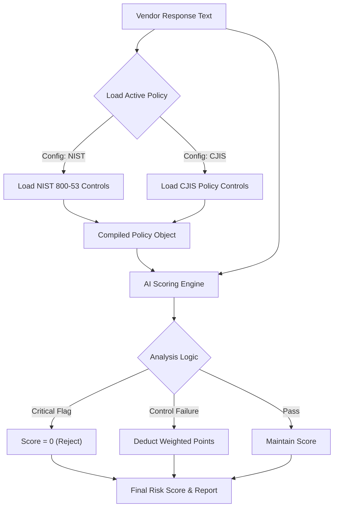

# ⚖️ AI TPRM Risk Engine (Context-Aware)

### Dynamic Vendor Risk Assessment & Compliance Auditing

[]()
[](https://www.python.org/downloads/)
[]()
[]()

---

### 📖 Overview
Legacy TPRM tools use static spreadsheets. This engine uses **"Context-Aware Logic"** and **"Policy-as-Code"** to dynamically generate risk frameworks based on the specific standards required for each vendor (NIST, CJIS, ISO, etc.).

Instead of checking generic boxes, the system acts as an **Automated GRC Analyst**:
* **High Assurance Vendor?** → Dynamically enforces **NIST 800-53 r5** controls.
* **Law Enforcement Data?** → Automatically enforces **CJIS Policy v5.9** (FIPS encryption).
* **AI Scoring:** Uses LLM logic to detect vague answers, critical gaps (MFA, Encryption), and calculates a precise risk score (0-100).


### ⚡ Feature Highlights
* **Dynamic Policy Library:** Toggle active frameworks (NIST, CJIS, ISO, CIS) via a simple YAML config.
* **Weighted Scoring Engine:** Calculates a precise risk score (0-100) based on control weights and critical failures.
* **AI-Driven Analysis:** Detects vague or non-compliant answers (e.g., "We use proprietary encryption" instead of "AES-256").
* **Auto-Remediation:** Maps failures to specific fix actions (e.g., "Implement SSO/MFA immediately").

---

### 🛠️ Quick Start

#### 1. Clone the Repository
```bash
git clone [https://github.com/codyjkeller/ai-tprm-analyzer.git](https://github.com/codyjkeller/ai-tprm-analyzer.git)
cd ai-tprm-analyzer
pip install -r requirements.txt
```

#### 2. Configure Your Standards
Edit `policies/vendor_standards.yaml` to select which frameworks to enforce:
```yaml
active_frameworks:
  - "nist_800_53_r5"  # High Assurance
  - "cjis_policy"     # Law Enforcement
  # - "iso_27001"     # Commercial (Commented out)
```

#### 3. Run the AI Analyst
Simulate an AI assessment against your active policy:
```bash
python src/analyze_vendor.py
```

---

### 🧠 Architecture Logic



---

### 📂 File Structure

```text
.
├── src/
│   ├── analyze_vendor.py     # Main Engine: Dynamic Policy Loading & AI Scoring
│   └── analyzer.py           # Legacy Script: Context-Aware Heuristics
├── policies/
│   └── vendor_standards.yaml # The "Brain": Library of NIST/CJIS/ISO Controls & Scoring Logic
├── config/
│   └── risk_matrix.yaml      # (Deprecated) Old scoring logic
├── requirements.txt          # Dependencies (Rich, PyYAML, Pandas)
└── README.md                 # Documentation
```
